# 🚀 Airdrop 888 - Auto Forwarder BOT

  
  
  
[](https://t.me/airdroplocked)

Bot Telegram canggih untuk **memantau dan meneruskan postingan airdrop** dari berbagai channel ke satu tempat terpusat — yaitu channel **[Airdrop 888](https://t.me/airdroplocked)**.

> 💡 **Tujuan Proyek:** Mengkonsolidasikan informasi airdrop yang tersebar di banyak channel agar para member tidak ketinggalan kesempatan penting.

---

## 🧭 Arsitektur Bot

```mermaid
graph TD
    A[📢 Channel Sumber 1] --> C{🤖 Forwarder BOT}
    B[📢 Channel Sumber 2] --> C
    D[📢 Channel Sumber N] --> C
    C --> E[🏆 Channel Airdrop 888]
```



---

## ✨ Fitur Utama

- ⚡ **Pemantauan Real-time:** Bot secara aktif memantau semua channel sumber dan langsung bertindak begitu ada pesan baru.  
- 🌐 **Dukungan Multi-Channel:** Dapat memantau banyak channel sekaligus dengan konfigurasi mudah.  
- 🖼️ **Mendukung Semua Jenis Pesan:** Meneruskan teks, gambar, video, dokumen, dan format pesan lainnya tanpa masalah.  
- 🧹 **Anti-Spam Pesan Lama:** Hanya meneruskan pesan baru setelah bot dijalankan, mencegah banjir pesan lama.  
- 💻 **Siap Hosting 24/7:** Dapat dijalankan terus-menerus di server atau layanan seperti Render.com.  

---

## 🛠️ Teknologi yang Digunakan

| Komponen | Keterangan |
|-----------|------------|
| **Bahasa** | Python 3 |
| **Library Utama** | [Telethon](https://docs.telethon.dev) |
| **Hosting Disarankan** | [Render.com](https://render.com) |

---

## 🚀 Panduan Instalasi & Konfigurasi

### 1️⃣ Prasyarat

- Python 3.8 atau lebih baru  
- Akun Telegram  
- Git sudah terinstal  

---

### 2️⃣ Clone Repositori

```bash
git clone https://github.com/airdrop-888/airdropForwarder-BOT.git
cd airdropForwarder-BOT
```

---

### 3️⃣ Dapatkan Kredensial Telegram

Bot ini berjalan sebagai **akun pengguna (user)**, bukan bot API.  
Kamu memerlukan **API ID** dan **API Hash** dari [my.telegram.org](https://my.telegram.org).

**Langkah:**
1. Login ke [my.telegram.org](https://my.telegram.org).  
2. Pilih **API development tools**.  
3. Buat aplikasi baru dan salin `api_id` dan `api_hash`.  
4. **Jaga kerahasiaan kredensial ini!**

**Untuk mendapatkan Channel ID:**
- Forward satu pesan dari setiap channel ke bot [@userinfobot](https://t.me/userinfobot).  
- Bot akan membalas dengan ID numerik (contoh: `-1001234567890`).

---

### 4️⃣ Konfigurasi File `.env`

Buat file bernama `.env` di root proyek, isi seperti berikut:

```env
# Kredensial dari my.telegram.org
API_ID=12345678
API_HASH=abcdef1234567890abcdef123456

# Nama file sesi
SESSION_NAME=my_user_session

# ID Channel (pisahkan dengan koma tanpa spasi)
SOURCE_CHANNELS=-100123456789,-100987654321
DESTINATION_CHANNEL=-1001122334455
```

> ⚠️ Pastikan `forwarder_bot.py` sudah dikonfigurasi untuk membaca environment variables ini.

---

### 5️⃣ Instalasi Dependensi

```bash
pip install -r requirements.txt
```

---

### 6️⃣ Jalankan Bot Secara Lokal

Saat pertama kali dijalankan, **Telethon** akan meminta nomor telepon dan kode OTP.

```bash
python forwarder_bot.py
```

Setelah login berhasil, bot akan langsung mulai memantau channel sumber.

---

## ☁️ Deploy ke Render.com (Gratis 24/7)

1. Daftar di [Render.com](https://render.com) menggunakan akun GitHub.  
2. Klik **New + > Background Worker**.  
3. Hubungkan repositori `airdrop-888/airdropForwarder-BOT`.  
4. Isi konfigurasi:
   - **Name:** `airdrop-forwarder-bot`  
   - **Start Command:** `python forwarder_bot.py`  
   - **Instance Type:** Free  
5. Tambahkan semua **Environment Variables** dari file `.env`.  
6. Klik **Create Background Worker**.

Render akan otomatis men-deploy dan menjalankan bot 24/7.

---

## 🤝 Bergabung dengan Komunitas Kami

Punya pertanyaan atau ingin gabung komunitas **airdrop hunter** kami?  
Kunjungi channel utama kami di Telegram!

[](https://t.me/airdroplocked)

---

## 👨‍💻 Kontributor

Terima kasih kepada semua yang telah berkontribusi dalam pengembangan proyek ini:

- **BalveerXYZ** — Founder & Developer  
- **Kontributor Lain** — Para anggota komunitas Airdrop 888 yang aktif memberikan ide dan feedback  

Ingin berkontribusi? Silakan fork repo ini dan ajukan pull request dengan ide atau perbaikanmu!

---

## 💖 Support Proyek Ini

Jika kamu merasa bot ini bermanfaat, dukung pengembangannya dengan cara:

- ⭐ Memberi bintang (star) pada repo ini di GitHub  
- 🔁 Membagikan ke teman-teman sesama airdrop hunter
